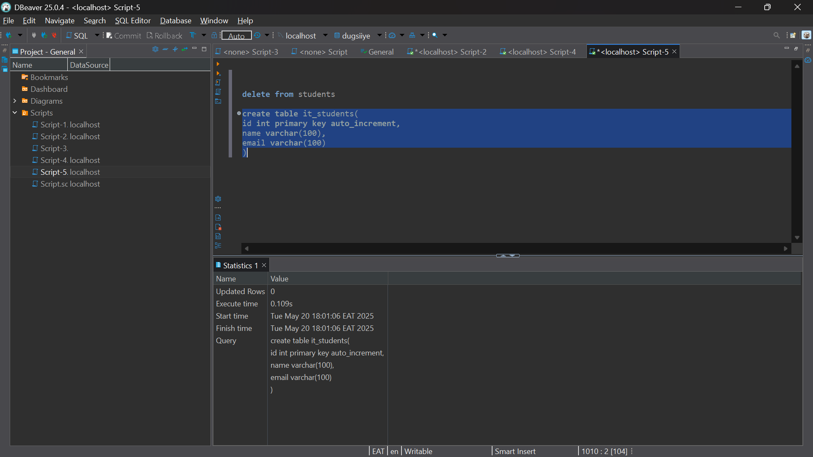
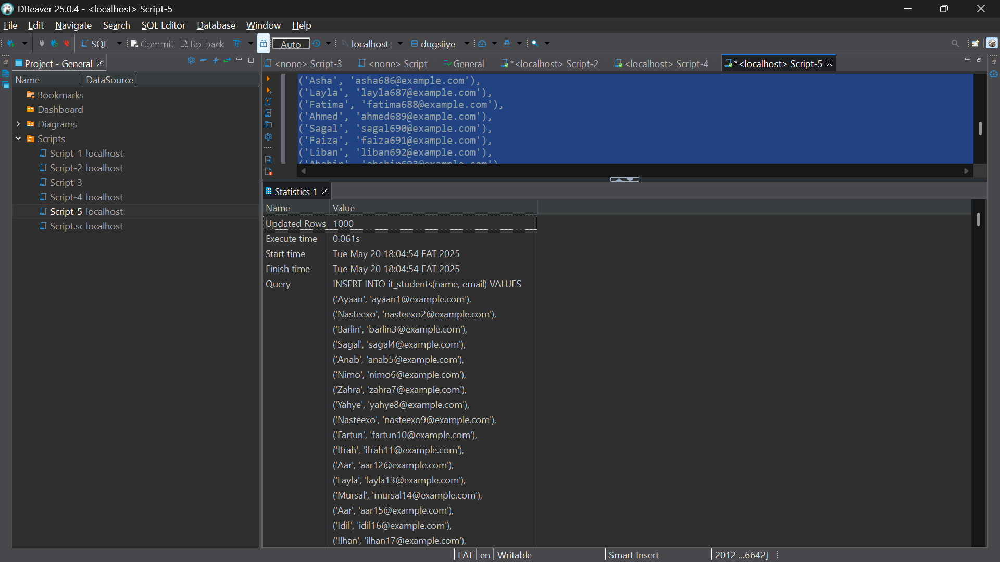
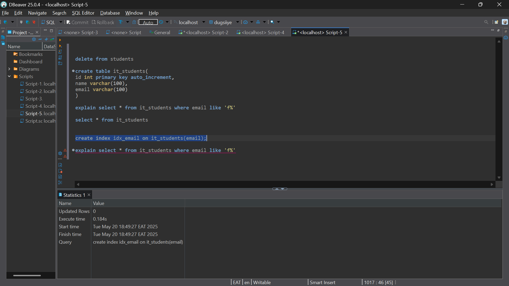
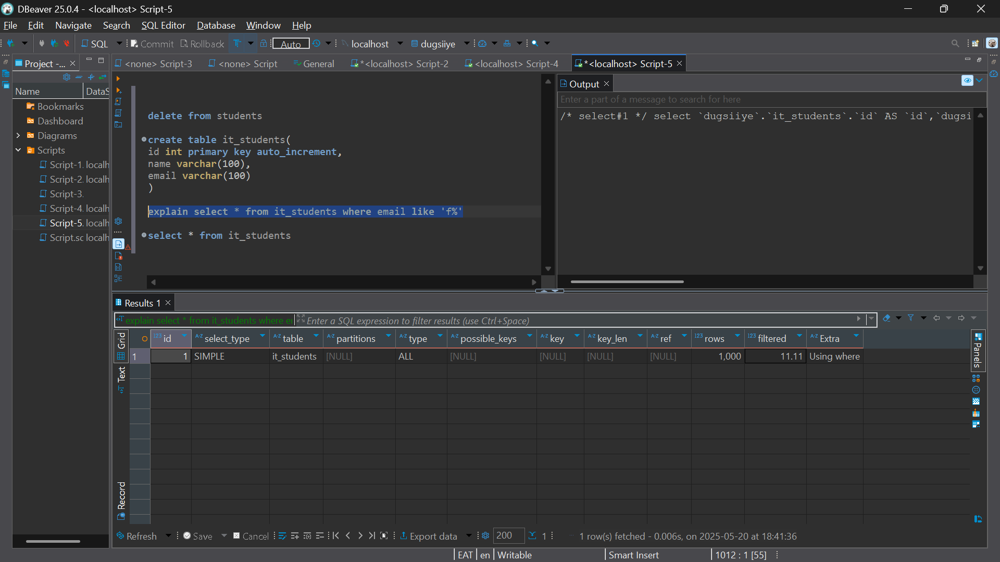
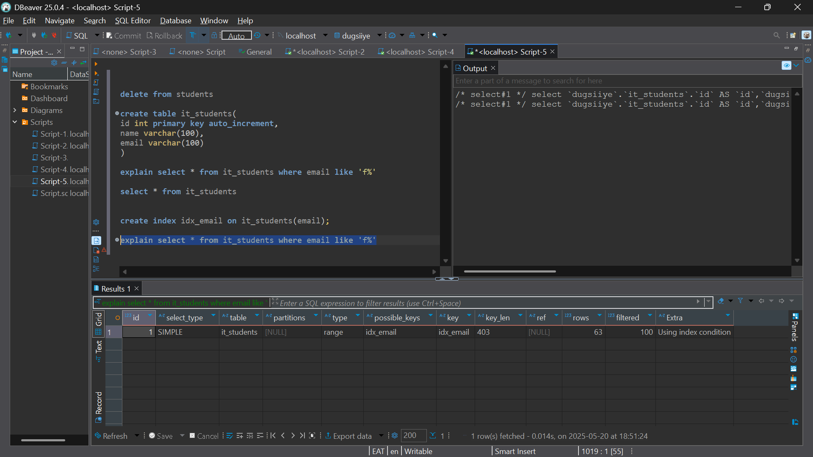

## 📌 Question 1



---

## 📌 Question 2



---

## 📌 Question 3



---

## 📌 Question 4



---

## 📌 Question 5 – Optimization Summary

### Why You Made These Changes:

#### ✅ Purpose of `CREATE INDEX`:
You created an index (`idx_email`) on the `email` column to **speed up lookups** for queries that filter emails using `LIKE 'f%'`.

#### ✅ Using `EXPLAIN`:
You used the `EXPLAIN` command to analyze query performance and confirm whether the index is being used.

---

### 🔍 What the EXPLAIN Output Shows:

| Column         | Value           | Meaning                                                  |
|----------------|-----------------|----------------------------------------------------------|
| `type`         | `range`         | ✅ Index **range scan** used — efficient for `LIKE 'f%'` |
| `possible_keys`| `idx_email`     | Index on `email` is **available**                        |
| `key`          | `idx_email`     | Index is **being used**                                  |
| `rows`         | `63`            | Estimated number of rows scanned                         |
| `Extra`        | `Using index condition` | Query is using the index to filter rows            |

---

### ✅ Conclusion

The query:
```sql
SELECT * FROM it_students WHERE email LIKE 'f%';


