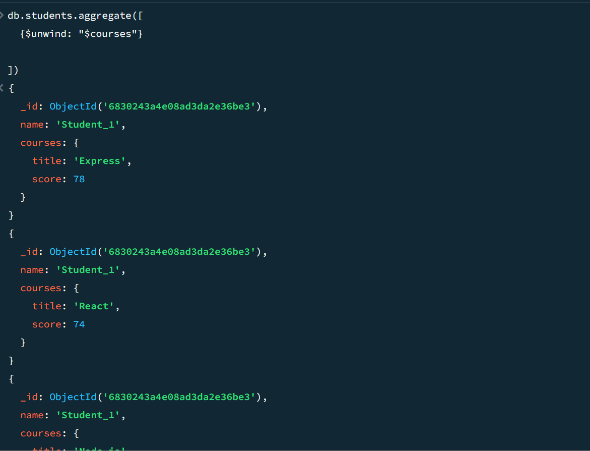
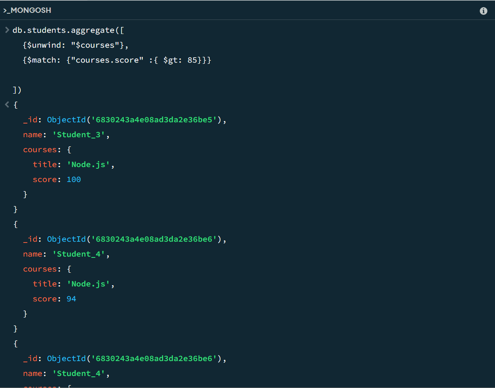
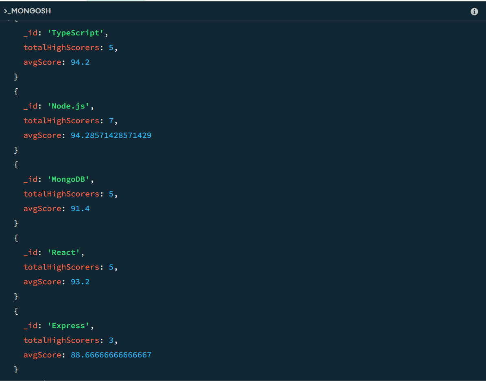
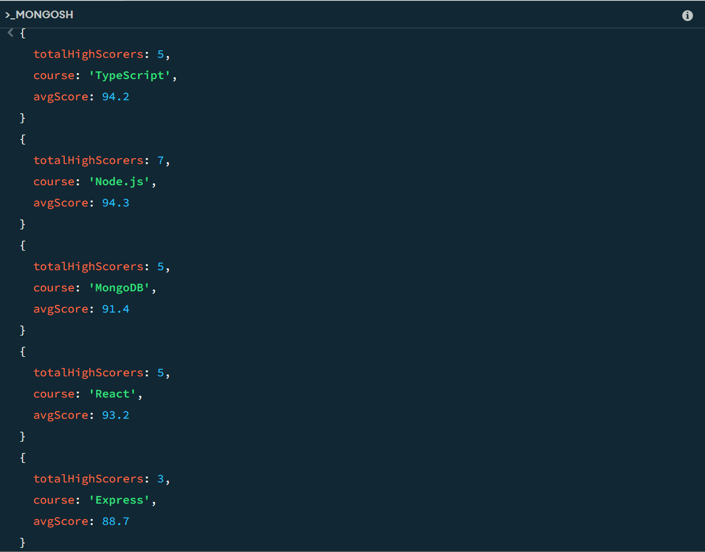
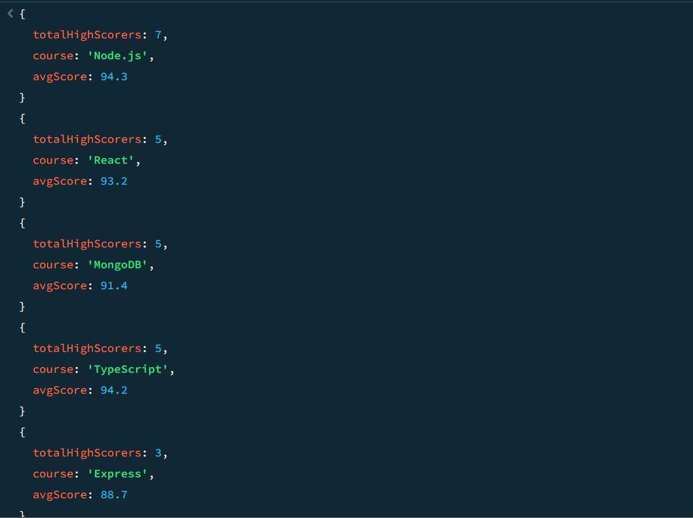

# 📊 MongoDB Aggregation Pipeline Tasks (Image-Based)

This README contains a series of MongoDB aggregation tasks. Each task includes a brief description and an accompanying image for reference.

---

## 🔹 Q1: Use `$unwind` to flatten the `courses` array

---

## 🔹 Q2: Use `$match` to filter only scores above 85

---

## 🔹 Q3: Use `$group` to count how many top performers per course

---

## 🔹 Q4: Use `$project` to rename `_id` to `course`, and show total

---

## 🔹 Q5: Use `$sort` to order by most high scorers

