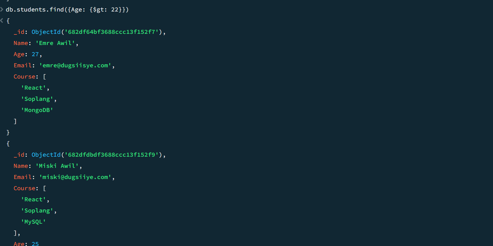
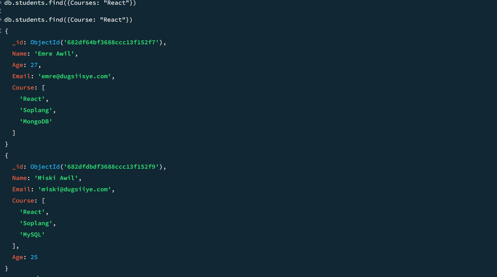
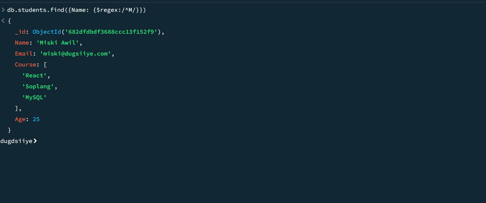
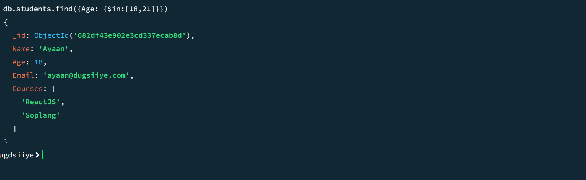
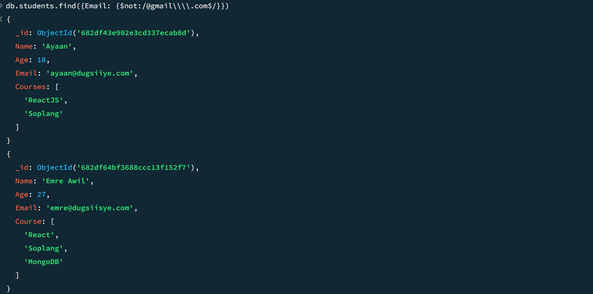
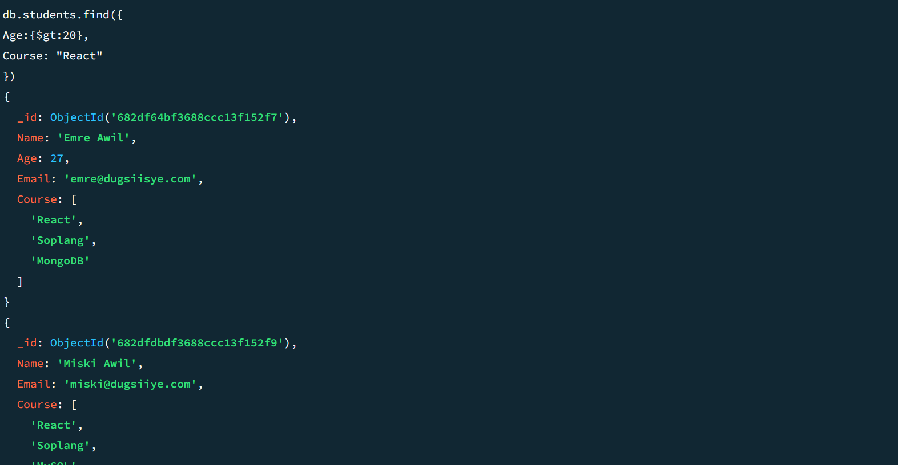
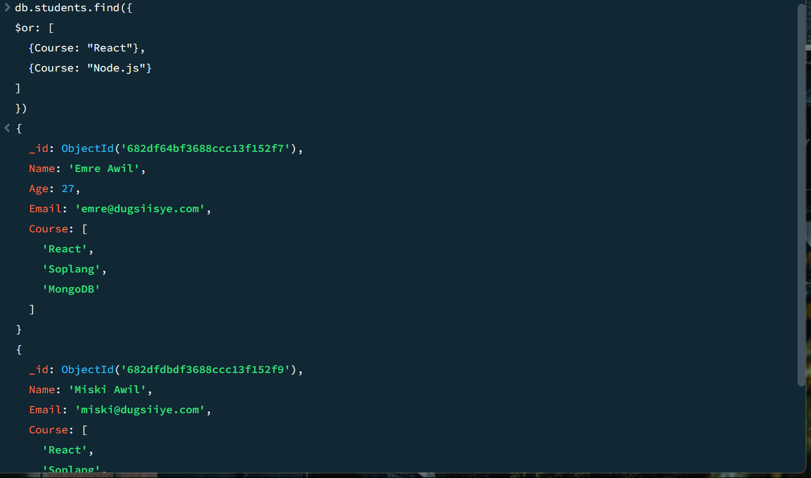
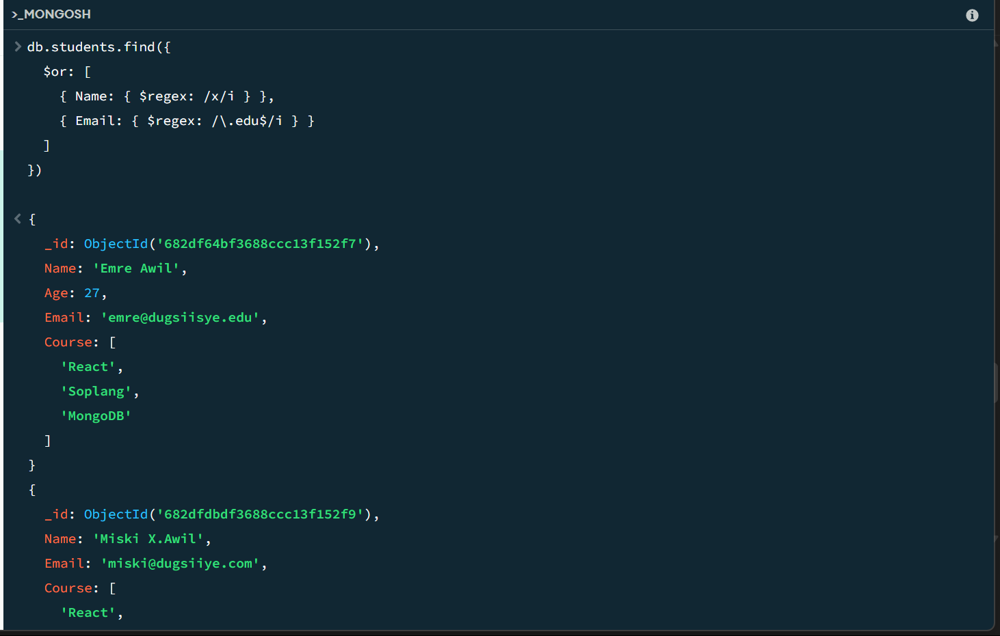

# 📘 Exercise-8 Questions (Image-Based)

This document contains image-based Exercise-8 questions. Each question is presented with an associated image for reference.

---

## ❓ Question 1

---

## ❓ Question 2

---

## ❓ Question 3

---

## ❓ Question 4

---

## ❓ Question 5

---

## ❓ Question 6

---

## ❓ Question 7

---

## ❓ Question 8

