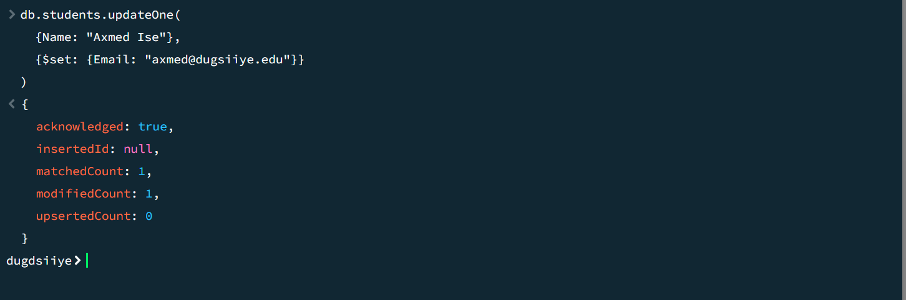
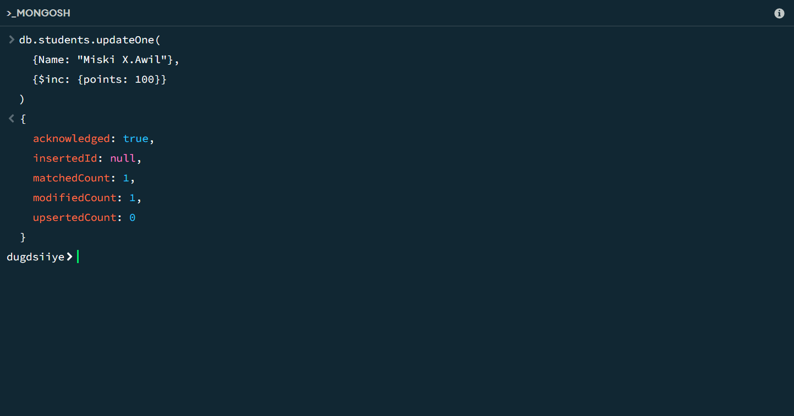
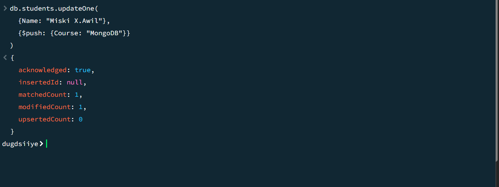
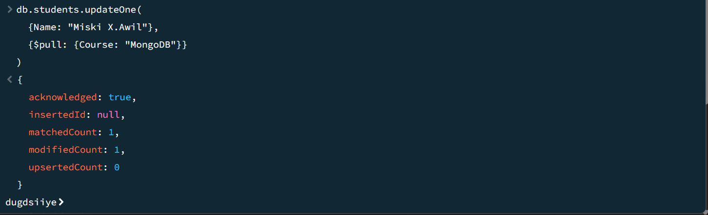
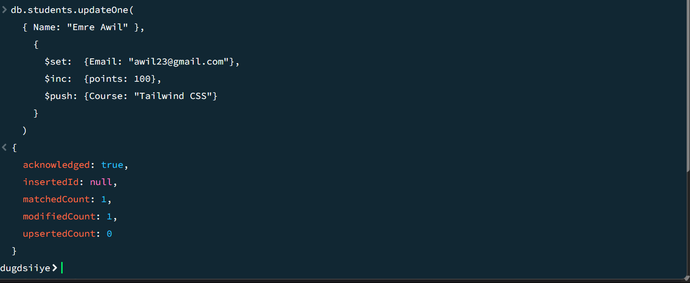

# 📘 Programming Questions (Image-Based)

This README contains a series of programming-related questions, each illustrated with an image. Review each image below to analyze and solve the respective problem.

---

## ❓ Question 1

---

## ❓ Question 2

---

## ❓ Question 3

---

## ❓ Question 4

---

## ❓ Question 5

---

## ❓ Question 6

